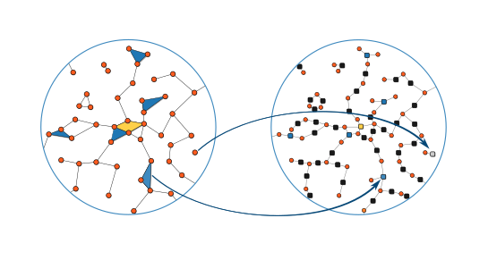

# scm

The Simplicial Configuration Model is random [null model](https://en.wikipedia.org/wiki/Null_model) for [simplicial complexes](https://en.wikipedia.org/wiki/Simplicial_complex), mathematical objects which can be seen as high-order generalizations of [simple graphs](http://mathworld.wolfram.com/SimpleGraph.html) (they incorporate multi-node interactions).
This repository contains a C++ reference implementation of a [Markov chain Monte Carlo (MCMC)](https://en.wikipedia.org/wiki/Markov_chain_Monte_Carlo) sampler for this model, see [arxiv:17xx.yyyy](https://arxiv.org/abs/17xx.yyyy) for more information.
A summary of compilation / usage instructions can be found below; but see the [tutorial][tutorial_notebook.ipynb] if you are looking for detailed instructions and examples.

This is joint work with [G. Petri](https://github.com/lordgrilo), F. Vaccarino, and [A. Patania](https://github.com/alpatania).

## Table of content

1. [Compilation](#compilation)
2. [Using the sampler](#using-the-sampler)
    1. [Facet list analyzer](#facet-list-analyzer)
    2. [MCMC sampler](#mcmc-sampler)
3. [Publications](#publications)

## Compilation

The sampler has two mandatory dependencies, namely `boost::program_options` and `cmake` (for automated building).

To compile, type :

    cmake .; make

The resulting binaries will be built in `bin/`. 

## Using the sampler

The sampler randomizes an initial facet list, and samples uniformly from the space of all simplicial complexes with the same **degree sequence** (degree = number of facet incident on a node) and **size sequence** (size = number of node in a facet).
As such, it requires an initial facet list.
We therefore provide not one but two important binaries: `facet_list_analyzer` and `mcmc_sampler`.

### Facet list analyzer

The MCMC sampler is not robust to badly formatted input, so we provide a facet list analyzer that:

1. Checks that the facet list indeed (correctly) describes a simplicial complex. That is, it makes sure that there is no included face in the list, and that the nodes IDs are **0 indexed and contiguous integers**.
2. Provides estimates of the *optimal sampling frequency* for the MCMC sampler (`m log m`, where `m` is the sum of the facet size).
3. Computes a number of other properties not directly relevant to sampling, but to estimate sampling complexity, etc., [see the paper](https://arxiv.org/abs/17xx).

### MCMC sampler

One the facet list is validated, using the sampler is as simple as the following example call:

    bin/mcmc_sampler -f 10000 -b 2000 -t 200 -d 42 seed_facet_list.txt

Here, `-f 10000` specifies that 10000 MCMC move will be applied before sampling again (*the sampling frequency*), `-b 2000` is the [*burn-in time*](https://en.wikipedia.org/wiki/Gibbs_sampling#Implementation) (the number of steps to throw away before sampling begins), `-t 200` asks for 200 samples, and `-d 42` set the seeds of the RNG to `42`.
`seed_facet_list.txt` is the path to the initial condition file (notice how it is the only positional argument).

By default the sampler uses the uniform proposal distribution with L_max = 2 max s  [see the paper](https://arxiv.org/abs/17xx), but the behavior can be changed.

The full list of option follows below:

    -b [ --burn_in ] arg (=1000)          Burn-in time.
    -t [ --sampling_steps ] arg (=1000)   Number of sampling steps.
    -f [ --sampling_frequency ] arg (=10) Number of step between each sample.
    -d [ --seed ] arg                     Seed of the pseudo random number 
                                          generator (Mersenne-twister 19937). 
                                          Seed with time if not specified.
    -l [ --l_max ] arg                    Manually set L_max. WARNING:
                                          The correctness of 
                                          the sampler is not guaranteed if L_max 
                                          < 2 max s.
    --exp_prop                            Use exponential proposal distribution.
    --pl_prop                             Use power law proposal distribution.
    --unif_prop                           Use uniform proposal distribution [default].
    --prop_param arg                      Parameter of the proposal distribution 
                                          (only works for the exponential and 
                                          power law proposal distributions).
    -v [ --verbose ]                      Output log messages.
    -h [ --help ]                         Produce this help message.

## Publications

Please cite:

"*Construction of and efficient sampling from the simplicial configuration model*" 
[J.-G. Young](http://jgyoung.ca), [G. Petri](https://github.com/lordgrilo), F. Vaccarino, and [A. Patania](https://github.com/alpatania) (2017) 
[arxiv:17xx.yyyy](https://arxiv.org/abs/17xx.yyyy)
